<a class="mk-toclify" id="table-of-contents"></a>

# Table of Contents
- [Chương 1: Bài tập khởi động](#ch-ng-1-b-i-t-p-kh-i-ng)
- [Chương 2: Các lệnh cơ bản trên môi trường UNIX](#ch-ng-2-c-c-l-nh-c-b-n-tr-n-m-i-tr-ng-unix)
- [Chương 3: Biểu thức chính quy (Regular Expressions)](#ch-ng-3-bi-u-th-c-ch-nh-quy-regular-expressions)
- [Chương 4: Morphological Analysis trong tiếng Nhật (形態素解析)](#ch-ng-4-morphological-analysis-trong-ti-ng-nh-t)
- [Chương 5: Dependency parsing (係り受け解析)](#ch-ng-5-dependency-parsing)
- [Chương 6: Machine Learning](#ch-ng-6-machine-learning)
- [Chương 7: Word Vectors](#ch-ng-7-word-vectors)
- [Chương 8: Neural Networks](#ch-ng-8-neural-networks)
- [Chương 9: RNN, CNN](#ch-ng-9-rnn-cnn)
- [Chương 10: Machine Translation](#ch-ng-10-machine-translation)

100 bài luyện tập xử lý ngôn ngữ tự nhiên phiên bản 2020
========================================================

Dịch từ tài liệu [言語処理100本ノック 2020](<https://nlp100.github.io/ja>) của lab Inui-Okazaki, đại học Tohoku, Nhật Bản. Người dịch: Phạm Quang Nhật Minh
(minhpqn).

**Note**: Khác với [phiên bản 2005](https://github.com/minhpqn/nlp_100_drill_exercises), phiên bản 2020 bổ sung 3 chương 8, 9, 10 về các nội dung liên quan đến mô hình Neural Networks.

<a class="mk-toclify" id="ch-ng-1-b-i-t-p-kh-i-ng"></a>
## Chương 1: Bài tập khởi động

### 00. Đảo ngược xâu ký tự

Đảo ngược xâu ký tự "stressed" (theo thứ tự từ cuối xâu đến đầu xâu ký tự).

### 01. "schooled"

Tạo một xâu kí tự bằng cách nối các kí tự ở vị trí 1, 3, 5, 7 trong xâu kí tự "schooled".

### 02. "shoe" + "cold" = "schooled"

Tạo xâu kí tự "schooled" bằng cách nối các kí tự trong "shoe" và "cold" luân phiên nhau từ đầu đến cuối.

### 03. Pi

Tách câu "Now I need a drink, alcoholic of course, after the heavy lectures involving quantum mechanics." thành các từ và 
tạo ra một danh sách (list) mà mỗi thành phần của nó biểu thị số các kí tự alphabet trong từ tương ứng.

### 04. Atomic symbols

Tách câu "Hi He Lied Because Boron Could Not Oxidize Fluorine. New Nations Might Also Sign Peace Security Clause. Arthur King Can." thành các từ
và trích xuất kí tự đầu tiên của các từ ở vị trí 1, 5, 6, 7, 8, 9, 15, 16, 19 và hai kí tự đầu tiên của các từ còn lại. Tạo một mảng kết hợp (đối tượng
dạng dictionary hoặc mapping) ánh xạ từ xâu được trích xuất tới vị trí (offset ở trong câu) của từ tương ứng.

### 05. n-gram

Viết hàm sinh ra tất cả các n-gram từ một dãy cho trước (xâu kí tự hoặc danh sách). Sử dụng hàm đã viết, sinh ra word bi-gram và character bi-gram từ câu "I am an NLPer"

### 06. Tập hợp

1.  Sinh ra tập X và Y tương ứng là tập các character bi-gram từ hai xâu ký tự
    "paraparaparadise" và "paragraph".
2.  Sinh ra các tập hợp union, intersection và difference của X và Y
3.  Kiểm tra xem bi-gram 'se' có thuộc tập X và Y hay không?

### 07. Sinh ra câu từ template

Viết hàm số nhận vào 3 biến x, y, z và trả về xâu ký tự "{y} vào lúc {x} giờ là {z}", trong đó {x}, {y} và {z} thể hiện giáo trị của x, y, z.
Sinh ra kết quả với các giá trị x, y, z sau đây x="12" y="Nhiệt độ" z=22.4

### 08. Xâu mật mã

Từ các ký tự của một xâu cho trước, cài đặt hàm có tên cipher để mã hoá xâu như
sau:

- Mọi ký tự tiếng Anh ở dạng thường (lower-case characters) c được chuyển
thành ký tự có mã là (219 - [mã ký tự ASCII của c]).
- Các ký tự khác giữ nguyên.

Sử dụng hàm đã viết để mã hoá và giải mã các xâu ký tự tiếng Anh.

### 09. [Typoglycemia](<https://en.wikipedia.org/wiki/Typoglycemia>)

Viết chương trình thực hiện việc sau:

- Nhận đầu vào là một câu tiếng Anh bao gồm các word ngăn cách nhau bằng ký tự
space. 
- Với mỗi word trong câu:
    * Nếu word đó không có nhiều hơn 4 kí tự, giữ nguyên word đó
    * Nếu không,
        + Giữ nguyên kí tự đầu và kí tự cuối của word
        + Đảo thứ tự một cách ngẫu nhiên các kí tự ở những vị trí khác (ở giữa của word đó).

Cho trước một câu tiếng Anh hợp lệ, ví dụ "I couldn't believe that I could actually understand what I
was reading : the phenomenal power of the human mind .", chạy chương trình đã
viết để đưa ra kết quả.

<a class="mk-toclify" id="ch-ng-2-c-c-l-nh-c-b-n-tr-n-m-i-tr-ng-unix"></a>
## Chương 2: Các lệnh cơ bản trên môi trường UNIX

Tệp [popular-names.txt](https://nlp100.github.io/data/popular-names.txt) là một tệp ở định dạng phân cách bằng dấu tab, lưu trữ "tên", "giới tính", "số người" và "năm sinh" của các em bé được sinh ra ở Hoa Kỳ. Viết chương trình thực hiện các xử lý sau đây. Tệp [popular-names.txt](https://nlp100.github.io/data/popular-names.txt) là đầu vào của của chương trình. Sau đó, chỉ dùng cách lệnh trong UNIX để thực hiện cùng các nhiệm vụ và xác nhận xem kết quả các lệnh UNIX đưa ra có giống với kết quả của chương trình bạn viết hay không.

### 10. Đếm số dòng trong file

Đếm số dòng trong file. Xác nhận kết quả bằng lệnh wc trong unix.

### 11. Biến đổi các ký tự tab thành space

Chuyễn mỗi ký tự tab thành ký tự space. Xác nhận kết quả bằng các lệnh
`sed`, `tr` hoặc `expand`.

### 12. Lưu cột 1 vào file col1.txt, cột 2 vào file col2.txt

Trích xuất nội dung trong cột 1, cột 2 của các dòng trong file và lưu vào các file tương ứng: `col1.txt`
và `col2.txt`. Thử thực hiện công việc với lệnh `cut` trong unix.

### 13. Trộn hai file col1.txt và col2.txt

Kết hợp nội dung trong 2 file `col1.txt` và `col2.txt` đã được tạo ra trong bài 12 để tạo thành một file mới có
nội dung giống gồm cột 1 và cột 2 trong file ban đầu và các cột cách nhau bởi ký tự tab. Sử dụng lệnh `paste` để thực hiện bài tập và xác nhận kết quả của chương trình bạn viết.

### 14. Trích xuất ra N hàng đầu tiên của file

Viết chương trình trích xuất ra *N* hàng đầu tiên của file. Biến số dòng lệnh là số tự nhiên *N*. Sử dụng lệnh `head` trong unix để thực hiện công việc.

### 15. Trích xuất ra N hàng cuối cùng của file

Viết chương trình trích xuất ra *N* hàng cuối cùng của file. Chương trình nhận đầu vào từ dòng lệnh là số tự nhiên *N*. Sử dụng lệnh `tail` trong unix để thực hiện công việc.

### 16. Chia file thành N phần

Nhận một số tự nhiên *N* từ đối số của dòng lệnh và chia file đầu vào thành *N* phần tại các ranh giới của các dòng (line boundaries). Xác nhận lại kết quả bằng lệnh `split` trong UNIX.

### 17. Các xâu phân biệt trong cột đầu tiên

Tìm các xâu phân biệt (một tập hợp các xâu) của cột đầu tiên của file. Xác nhận lại kết quả bằng cách dùng lệnh `cut`, `sort` và `uniq`.

### 18. Sắp xếp các dòng theo thứ tự tăng dần của cột thứ 3

Sắp xếp các dòng theo thứ tự tăng dần của các số trong cột thứ 3 (sắp xếp các dòng nhưng không thay đổi nội dung của trong mỗi dòng). Xác nhận lại kết quả với lệnh `sort`.

### 19. Sắp xếp theo tần suất xuất hiện

Đưa ra tần suất xuất hiện của các giá trị trong cột 1; sắp xếp các giá trị trong
cột 1 theo thứ tự từ cao đến thấp của tần suất xuất hiện.Xác nhận lại kết quả bằng việc dùng các lệnh `cut`,
`uniq`, `sort`.

<a class="mk-toclify" id="ch-ng-3-bi-u-th-c-ch-nh-quy-regular-expressions"></a>
## Chương 3: Biểu thức chính quy (Regular Expressions)

Tệp [enwiki-country.json.gz](https://nlp100.github.io/data/enwiki-country.json.gz) lưu trữ các bài viết Wikipedia ở định dạng:

- Mỗi dòng lưu trữ một bài viết Wikipedia ở định dạng JSON.
- Mỗi tài liệu JSON có các cặp khóa-giá trị:
    * Tiêu đề của bài viết là giá trị ứng với khóa "title".
    * Phần nội dung của bài viết là giá trị ứng với khóa "text".
- Toàn bộ tập tin được nén bởi gzip.

Viết mã thực hiện các công việc sau.

### 20. Đọc vào dữ liệu JSON

Đọc các tài liệu JSON, trích xuất và hiển thị nội dung của bài viết về United Kingdom. Sử dụng các nội dung của tài liệu được trích xuất này để thực hiện các nhiệm vụ trong các bài tập từ 21-29.

### 21. Trích xuất các dòng có chứa tên đề mục

Trong các tài liệu, trích xuất các dòng có chứa tên đề mục (category name).

### 22. Trích xuất các tên đề mục

Trích xuất tên đề mục của trong các tài liệu. Trong bài tập này, cần trích xuất
chính xác các tên đề mục chứ không phải dòng chứa tên đề mục.

### 23. Cấu trúc của các Section

Hiển thị tên của các section và level của các section trong các tài liệu
Wikipedia (Ví dụ với section == Section Name ==" thì level bằng 1)

### 24. Trích xuất các liên kết file

Trích xuất toàn bộ các liên kết đến các media files trong tài liệu.

### 25. Infobox

Trích xuất tên trường và giá trị của chúng trong Infobox "country" và lưu trữ chúng trong một đối tượng từ điển (dictionary).

### 26. Loại bỏ các emphasis markups

Trong khi làm các xử lý ở bài tập 25, xoá các MediaWiki emphasis markup (italic, bold,
both) trong giá trị của các trường và biến đổi thành plain text. Xem thêm tại [Help:Cheatsheet](https://en.wikipedia.org/wiki/Help:Cheatsheet).

### 27. Xóa bỏ các Internal Links

Bên cạnh những xử lý trong bài tập 26, hãy xóa những liên kết trong từ các giá trị của các trường. Xem thêm tại [Help:Cheatsheet](https://en.wikipedia.org/wiki/Help:Cheatsheet).

### 28. Xoá các markup trong văn bản

Ngoài các xử lý ở bài 27, hãy xoá các Media markup trong các giá trị của các trường ở Infobox càng nhiều càng tốt
và in ra các thông tin cơ bản về quốc gia ở dạng plaintext.

### 29. Lấy ra các URL của quốc kỳ

Lấy URL của quốc gia bằng cách sử dụng kết quả phân tích của Infobox. (Gợi ý: chuyển đổi tham chiếu file thành URL bằng cách gọi [imageinfo](<https://www.mediawiki.org/wiki/API:Imageinfo>) trong [MediaWiki API](https://www.mediawiki.org/wiki/API:Main_page))

<a class="mk-toclify" id="ch-ng-4-morphological-analysis-trong-ti-ng-nh-t"></a>
## Chương 4: Morphological Analysis trong tiếng Nhật (形態素解析)

Dùng [MeCab](http://taku910.github.io/mecab) để phân tích hình thái cho nội dung text của cuốn tiểu thuyết "Tôi là một con mèo" ([neko.txt](https://nlp100.github.io/data/neko.txt)) tác giả Soseki Natsume, và lưu kết quả vào file neko.txt.mecab. Sử dụng file kết quả để thực hiện các công việc ở các bài tập dưới đây.

Đối với các bài tập 37, 38, 39, có thể sử dụng các phần mềm
[matplitlib](<http://matplotlib.org/>) hoặc
[Gnuplot](<http://www.gnuplot.info/>).


### 30. Đọc vào kết quả morphological analysis

Viết chương trình đọc vào kết quả morphological analysis (file neko.txt.mecab).

Yêu cầu: Với mỗi morpheme, lưu các thông tin: 表層形 (surface form), 基本形
(base form), 品詞 (pos), 品詞細分類1 (pos1) bằng cấu trúc dữ liệu hash map với
các key tương ứng là: surface, base, pos, pos1. Lưu trữ mỗi câu bằng danh sách
của các morpheme. Trong các bài tập còn lại trong chương 4, hãy sử dụng cách tổ
chức dữ liệu trong bài này.

### 31. Động từ

Trích xuất tất cả các surface forms của động từ (pos=動詞).

### 32. Dạng nguyên thể của động từ (動詞の原形)

Trích xuất tất cả dạng nguyên thể của động từ (base form).

### 33.「AのB」

Trích xuất tất cả các danh từ ghép (compound nouns) gồm 2 danh từ kết nối bằng の.

### 34. Trích xuất các kết nối danh từ (noun connections hay 名詞の連接)

Trích xuất tất cả các noun connections (các danh từ đứng cạnh nhau liên tiếp). Khi trích xuất, chú ý trích xuất chuỗi danh từ matching dài nhất có thể. Ví dụ ABC trong đó A, B, C là danh từ thì phải trích xuất ABC thay vì AB.

### 35. Tần suất xuất hiện của từ

Lập trình tính tần suất xuất hiện của từ trong văn bản. Đưa ra các từ theo thứ tự giảm dần của tần suất xuất hiện.

### 36. Top 10 từ xuất hiện nhiều nhất

Vẽ đồ thị (ví dụ bar graph) của tần suất xuất hiện của 10 từ xuất hiện nhiều nhất trong văn bản.

### 37. Top 10 từ đồng xuất hiện với từ 猫

Vẽ đồ thị (ví dụ: bar plot) tần suất xuất hiện của top 10 từ đồng xuất hiện nhiều nhất với từ 猫.

### 38. Histogram

Vẽ đồ thị histogram tần suất xuất hiện của các từ. Trục ngang là tần suất xuất hiện. Trục dọc là các từ.

### 39. Luật Zipf

Vẽ đồ thị với trục ngang là rank của các từ theo tần suất xuất hiện (cao đến thấp), trục dọc là tần suất xuất hiện của các từ. Vẽ đồ thị [log-log](https://en.wikipedia.org/wiki/Log%E2%80%93log_plot) để thể hiện.

<a class="mk-toclify" id="ch-ng-5-dependency-parsing"></a>
## Chương 5: Dependency parsing (係り受け解析)

Thực hiện phân tích cấu trúc ngữ pháp (dependency parsing) bằng công cụ
[CaboCha](<http://taku910.github.io/cabocha/>) cho file
[neko.txt](https://nlp100.github.io/data/neko.txt) và lưu kết
quả vào file neko.txt.cabocha. Sử dụng file kết quả này làm đầu vào cho các bài
tập dưới đây.

### 40. Đọc vào kết quả dependency parsing (theo morphemes)

Cài đặt lớp Morph cho các morphemes. Lớp này có các biến thành phần (member
variables) là surface (cho surface forms của morphems), base (cho base form),
pos (cho POS tag), pos1 (cho detailed POS tag - 品詞細分類). Sau đó đọc vào kết
quả phân tích dependency parsing trong file neko.txt.cabocha. Mỗi câu sẽ bao gồm
một danh sách các Morph objects. Hiển thị danh sách các morphemes cho câu thứ 3
trong văn bản.

### 41. Đọc vào kết quả dependency parsing (theo chunks và depedency relations)

Tiếp theo bài 40, cài đặt lớp Chunk để lưu trữ các chunk (hay bunsetsu (文節)).
Lớp này có các biến thành phần là:

- morphs (để lưu trữ danh sách các Morph
objects)
- dst để lưu trữ index của chunk mà chunk hiện tại trỏ đến (chunk đích - destination)
- srcs để lưu trữ danh sách các indexes của các chunk trỏ đến chunk hiện tại.

Sau đó, đọc vào kết quả dependency parsing. Mỗi câu sẽ bao gồm danh sách của các
Chunk objects. Hiển thị nội dung text và giá trị của biến dst của các chunk trong câu
thứ 8 của file đầu vào.

Các bài tập còn lại trong chương 5 sẽ sử dụng các chương trình được tạo ra ở đây.

### 42. Hiển thị chunk nguồn (head) và chunk đích (modifier) trong các depedency relations

Hiển thị nội dung dạng text các chunk nguồn (head) và chunk đích (modifier)
trên mỗi dòng và cách nhau bởi ký tự tab. Chú ý không hiển thị các dấu
(punctuation marks) trong các chunk.

### 43. Trích xuất các dependency relations giữa các chunk chứa danh từ và các chunk chứa động từ

Trích xuất các dependency relations giữa các chunk chứa danh từ và các chunk
chứa động từ và in ra nội dung text trên mỗi dùng và các thành phần cách nhau bởi dấu cách. Tương tự như bài 42, không hiển thị các
dấu (punctuation marks) trong các chunk.

### 44. Visualize cây dependency

Visualize cây phụ thuộc của câu đã cho dưới dạng biểu đồ có hướng. Để visualize, có thể chuyển đổi cây phụ thuộc sang ngôn ngữ DOT và sử dụng Graphviz. Thêm nữa, khi visualize một đồ thị có hướng trong Python, có thể sử dụng pydot.

### 45. Trích xuất case pattern của động từ

Yêu cầu của bài tập này là tìm hiểu (investigate) về case frame trong tiếng Nhật
sử dụng dữ liệu trong file đầu vào neko.txt. Coi các động từ là vị ngữ
(predicate), các trợ từ (như が,を,...) của chunk liên kết với với động từ là các case, hãy
in ra các vị ngữ và các "case" theo định dạng cách nhau bởi ký tự tab. Output
của chương trình cần thoả mãn các điều kiện sau: 

- Ở các chunk có chứa động từ, sử dụng dạng nguyên thể của động từ trái nhất làm vị ngữ.
- Coi các trợ từ liên kết với các vị ngữ là các "case" trong case frame. 
- Nếu một vị ngữ được liên kết bởi nhiều trợ từ (chunk), in tất cả các trợ từ theo thứ tự từ điển. Các trợ từ cách nhau bởi dấu cách

Xem xét ví dụ sau: 吾輩はここで始めて人間というものを見た (câu thứ 8 trong
file neko.txt.cabocha). Câu này gồm hai động từ 始める và 見る. Nếu trong kết
quả phân tích cú pháp, động từ 始める liên kết với chunk ここで, động từ 見る
liên kết với với chunk 吾輩は và ものを, chương trình sẽ in ra:

```
始める で
見る は を
```

Lưu output của chương trình ra file, xác nhận các mục sau chỉ với các lệnh của Unix.

- Kết hợp của các vị ngữ và case phổ biển trong corpus.
- Các case patterns của các động từ する, 見る, 与える (theo thứ tự từ cao đến thấp của tần suất xuất hiện trong corpus).

### 46. Trích xuất thông tin của case pattern của động từ

Chỉnh sửa bài tập 45, trích xuất thêm các chunks mà các vị ngữ (predicate) liên
kết tới. In ra theo định dạng tab. Ngoài các điều kiện đưa ra ở bài tập 45,
output phải thoả mãn các điều kiện sau.

- Các modifier là dãy các word của các chunk liên kết tới vị ngữ (không cần phải xoá đuôi và các trợ từ).
- Trong trường hợp một predicate liên kết với nhiều chunk (bunsetsu), in ra các chunk này theo thứ tự của các trợ từ trong các chunk. Dùng ký tự space để ngăn cách giữa các chunk.

Xem xét ví dụ sau: 吾輩はここで始めて人間というものを見た (câu thứ 8 trong
file neko.txt.cabocha). Câu này gồm hai động từ 始める và 見る. Nếu trong kết
quả phân tích cú pháp, động từ 始める liên kết với chunk ここで, động từ 見る
liên kết với với chunk 吾輩は và ものを, chương trình sẽ in ra:

```
始める  で      ここで
見る    は を   吾輩は ものを
```

### 47. Mining các cấu trúc câu có động từ chức năng

(cấu trúc này có tên tiếng Nhật là 機能動詞構文)

Bài tập này tập trung vào các case frame を của các động từ, trong đó động từ có dạng liên kết サ変接続名詞. Sửa chương trình trong bài tập 46 để thoả mãn các yêu cầu sau đây.

- Bài tập này tập trung vào các bunsetsu có dạng 「サ変接続名詞+を（助詞）」 liên kết với động từ. 
- Biến đổi các vị ngữ về dạng 「サ変接続名詞+を+動詞の基本形」. Nếu trong 1 chunk có nhiều động từ, sử dụng động từ bên trái nhất.
- Trong trường hợp một vĩ ngữ có liên kết với nhiều trợ từ (chunk), in tất cả các trợ từ này theo thứ tự từ điển. Các trợ từ cách nhau bởi dấu cách.
- Trong trường hợp có nhiều chunks liên kết với một vị ngữ (predicate), in tất cả các chunk này đồng nhất với thứ tự in của các trợ từ mà nó bao gồm. Các chunk được cách nhau bởi ký tự space.

Ví dụ, cho câu sau. 「別段くるにも及ばんさと、主人は手紙に返事をする。」. Chương trình sẽ in ra kết quả sau.

```
返事をする と に は 及ばんさと 手紙に 主人は
```

Lưu kết quả của chương trình ra file, chỉ sử dụng lệnh unix để xác nhận:

- Các vị ngữ thường gặp trong corpus (danh từ liên kết sahen + động từ)
- Các vị ngữ và các case patterns thường xuất hiện trong văn bản.

### 48. Trích xuất ra dependency path từ các danh từ đến gốc

Chương trình yêu cầu trích xuất ra depedency path từ các chunk có chứa danh từ đến root của cây depedency. Các dependency path phải thoả mãn yêu cầu sau đây.

- Biểu diễn các chunk (bunsetsu) dưới dạng chuỗi của các morpheme (surface form)
- Biểu diễn liên kết giữa các bunsetsu bằng ký tự mũi tên ```->```.

Ví dụ, đầu ra cho câu ví dụ 「吾輩はここで始めて人間というものを見た」(câu thứ 8 trong file neko.txt.cabocha) như sau:

```
吾輩は -> 見た
ここで -> 始めて -> 人間という -> ものを -> 見た
人間という -> ものを -> 見た
ものを -> 見た
```

### 49. Trích xuất ra chuỗi liên kết giữa các danh từ

Trích xuất dependency path ngắn nhất liên kết giữa các cặp noun chunk. Đối với cặp
noun chunk với index tương ứng là *i* và *j* (*i* \< *j*), các dependency paths
thoả mãn các yêu cầu sau.

- Giống như bài 48, biểu diễn liên kết giữa các
bunsetsu bằng ký tự mũi tên (-\>).
- Thay các noun chunk *i*, và *j* tương ứng
thành X và Y.

Thêm nữa, các dependency path trong bài tập này có thể được diễn dịch như sau.

- Trên đường đi của noun chunk *i* tới gốc của cây, nếu tồn tại noun chunk *j*: trích xuất dependency path giữa noun chunk *i* và noun chunk *j*.
- Ngoài trường hợp nói trên, nếu đường đi của noun chunk *i* và noun chunk *j* tới gốc của cây cắt nhau ở bunsetsu *k*: In ra đường đi từ *i* tới bunsetsu ngay trước *k* và
đường đi từ bunsetsu *j* tới bunsetsu ngay trước *k*. Biểu diễn liên kết với
bunsetsu *k* bằng ký tự \|.

Ví dụ, kết quả đưa ra cho câu ví dụ
「吾輩はここで始めて人間というものを見た」(câu thứ 8 trong file
neko.txt.cabocha) như sau:

```
Xは | Yで -> 始めて -> 人間という -> ものを | 見た
Xは | Yという -> ものを | 見た
Xは | Yを | 見た
Xで -> 始めて -> Y
Xで -> 始めて -> 人間という -> Yを
Xという -> Y
```

<a class="mk-toclify" id="ch-ng-6-machine-learning"></a>
## Chương 6: Machine Learning

Trong chương trình, chúng ta sẽ sử dụng bộ dữ liệu [News Aggregator Data Set](https://archive.ics.uci.edu/ml/datasets/News+Aggregator) của Fabio Gasparatti và thực hiện bài toán phân loại tiêu đề của các bài báo thành "business", "science and technology", "entertainment", "health".

### 50. Tải và chuẩn bị dữ liệu

Tải xuống bộ dữ liệu [News Aggregator Data Set](https://archive.ics.uci.edu/ml/datasets/News+Aggregator), tạo ra dữ liệu huấn luyện (train.txt), dữ liệu kiểm chứng (valid.txt) và dữ liệu đánh giá (test.txt) theo hướng dẫn dưới đây.

1. Giải nén file zip đã tải xuống, đọc hướng dẫn của file readme.txt
2. Trích xuất ra các example (bài báo) của các báo "Reuters", "Huffington Post", "Businessweek", "Contactmusic.com", "Daily Mail".
3. Sắp xếp lại các example đã trích xuất theo thứ tự ngẫu nhiên.
4. Phân chia các example đã trích xuất với tỉ lệ 80% cho tập train, còn lại dùng 10% cho tập kiểm chứng và 10% cho tập đánh giá và lưu thành các file train.txt, valid.txt, test.txt. Trong các file, mỗi dòng lưu một example, tên của category và title của các bài báo được phân cách bởi dấu tab (Các file này sau này sẽ được dùng lại trong bài tập 70).

Sau khi tạo dữ liệu train và dữ liệu đánh giá, hãy thống kê số lượng example của các nhãn.

### 51. Trích xuất đặc trưng

Trích xuất đặc trưng từ dữ liệu train, dữ liệu kiểm chứng và dữ liệu đánh giá, lưu vào các file tương ứng train.feature.txt, valid.feature.txt, test.feature.txt. Bạn có thể tự do thiết kế các đặc trưng có thể hữu ích cho việc phân loại. Baseline đơn giản nhất là dùng dùng dãy các từ trong title của bài báo làm đặc trưng.

### 52. Training

Dùng dữ liệu huấn luyện được tạo ra trong bài tập 51, hãy huấn luyện mô hình Logistic Regression.

### 53. Prediction

Sử dụng mô hình Logistic Regression đã huấn luyện trong bài 52, hãy cài đặt chương trình phân loại một tiêu đề của một bài báo cho trước và tính xác suất dự đoán.

### 54. Tính độ chính xác của mô hình

Hãy tính độ chính xác của mô hình Logistic Regression đã học ở bài tập 52 trên tập dữ liệu huấn luyện (train) và tập dữ liệu đánh giá (test).

### 55. Tạo Confusion Matrix

Tạo confusion matrix của mô hình Logistic Regression đã học ở bài tập 52 trên dữ liệu huấn luyện và dữ liệu đánh giá.

### 56. Tính toán Precision, Recall và F1

Hãy tính Precision, Recall, F1 của mô hình Logistic Regression đã học ở bài tập 52 trên dữ liệu test. Tính Precision, Recall, F1 cho từng nhãn rồi tính các giá trị micro-average, macro-average cho các độ đo.

### 57. Xác nhận độ quan trọng của các features

Trong mô hình Logistic Regression đã học ở bài tập 52, hãy xác nhận top-10 các features có trọng số cao nhất và top-10 các features có trọng số thấp nhất.

### 58. Thay đổi tham số hiệu chỉnh (regularizer)

Khi huấn luyện mô hình Logistic Regression, bằng việc thay đổi tham số hiệu chỉnh (Regularization), chúng ta có thể kiểm soát được vấn đề overfitting. Hãy huấn luyện mô hình Logistic Regression bằng các tham số hiệu chỉnh khác nhau và tính độ chính xác trên các tập train, valid và test. Hãy tổng hợp kết quả thực nghiệm trên đồ thị với trục hoành là tham số hiệu chỉnh và trục tung là độ chính xác.

### 59. Hyperparameter Search

Hãy vừa thay đổi thuật toán học máy và các hyperparameter vừa huấn luyện mô hình phân loại. Đưa ra thuật toán học máy, hyperparameter đạt kết quả tốt nhất trên tập valid. Sau đó tính độ chính xác trên tập test sử dụng thuật toán học máy - hyperparameters đã xác định.

<a class="mk-toclify" id="ch-ng-7-word-vectors"></a>
## Chương 7: Word Vectors

Liên quan đến word vector (word embedding) biểu diễn ý nghĩa của các từ bằng vector số thực, hãy cài đặt chương trình thực hiện các xử lý sau đây

### 60. Đọc và hiển thị word vector

Download bộ word vectors (3,000,000 từ-phrases, 300 chiều) đã được huấn luyện trên tập dữ liệu Google News (khoảng 100 tỉ từ), hiển thị word vector của từ "United States". Chú ý rằng thực tế, bên trong mô hình, từ "United States" được biểu diễn bằng "United_States".

### 61. Word similarity

Tính cosine similarity của từ "United States" và "U.S."

### 62. Hiển thị top 10 có độ tương tự cao nhất

Trích xuất 10 từ có cosine similarity cao nhất với từ "United States" và giá trị cosine similarity của chúng.

### 63. Anology theo tính chất của phép cộng

Lấy word vector của từ "Spain" trừ đi vector của từ "Madrid", cộng vào vector của từ "Athens", đưa ra 10 từ có độ tương tự cao nhất với vector thu được cùng với độ tương tự của chúng.

### 64. Thực nghiệm trên dữ liệu Analogy

Tải xuống [dữ liệu đánh giá cho bài toán Word Analogy](http://download.tensorflow.org/data/questions-words.txt), tính vec(từ ở cột thứ hai) - vec(từ ở cột đầu tiên) + vec(từ ở cột thứ ba) và tìm từ có độ tương tự cao nhất với vectơ thu được cùng với giá trị của độ tương tự. Viết thêm từ được tìm ra và độ tương tự vào cuối mỗi ví dụ.

### 65. Tính độ chính xác trên task Word Analogy

Sử dụng kết quả của bài 64, tính độ chính của semantic analogy và syntactic analogy.

### 66. Đánh giá trên tập dữ liệu WordSimilarity-353

Download tập dữ liệu đánh giá [The WordSimilarity-353 Test Collection](http://www.gabrilovich.com/resources/data/wordsim353/wordsim353.html), hãy tính độ tương quan Spearman giữa xếp hạng độ tương tự được tính toán dựa trên word vectors và xếp hạng được đoán định bởi con người.

### 67. k-means clustering

Trích xuất các word vectors của các word liên quan đến tên quốc gia, sau đó thực hiện k-means clustering với số cluster k=5.

### 68. Clustering theo phương pháp Ward

Trích xuất các word vectors của các word liên quan đến tên quốc gia, thực hiện hierarchical clustering bằng phương pháp Ward. Visualize kết quả clustering dưới dạng dendogram.

### 69. Visualize bằng t-SNE

Visualize không gian vector của các word liên quan đến tên quốc gia bằng t-SNE.

<a class="mk-toclify" id="ch-ng-8-neural-networks"></a>
## Chương 8: Neural Networks

Cài đặt mô hình phân loại bằng mạng neural cho bài toán phân loại các bài báo đã làm trong chương 6. Sử dụng các nền tảng học máy như PyTorch, TensorFlow hoặc Chainer trong chương này.

### 70. Sử dụng tổng của các word vectors làm features

Chúng ta muốn chuyển đổi dữ liệu train, valid và test được xây dựng trong bài tập 50 thành ma trận và vectơ.

Ví dụ, đối với dữ liệu train, chúng ta muốn tạo một ma trận X gồm các vectơ đặc trưng  của tất cả các example  và ma trận (vectơ) Y gồm các nhãn của các example.

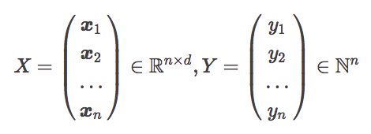

Ở đây *n* là số lượng các example trong dữ liệu train,  và  lần lượt biểu diễn vectơ đặc trưng và nhãn của ví dụ thứ . Chú ý rằng, chúng ta sẽ dùng 4 nhãn "business", "science and technology", "entertainment", "health". Nếu sử dụng kí hiệu  để biểu diễn các số tự nhiên nhỏ hơn 4 (bao gồm cả 0), thì chúng ta có thể biểu diễn nhãn  của một example bất kì bằng . Sau đây, chúng ta sẽ biểu diễn số lớp là *L* (trong bài toán phân loại hiện tại thì *L* = 4).

Vector đặc trưng  của example thứ *i* sẽ được tính bởi công thức sau.

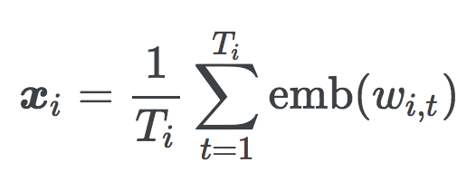

Ở đây, example thứ *i* được cấu thành từ một dãy  token ,  là word vector (số chiều là *d*) tương ứng với token *w*. Tức là, title của bài báo của điểm dữ liệu thứ *i* được biểu diễn bằng vector  sẽ được tính bằng cách lấy trung bình các word vector của các token nằm trong title đó. Trong chương này, chúng ta có thể sử dụng bộ word vector đã tải về trong bài tập 60. Vì chúng ta dùng các word vector với số chiều 300 nên *d*=300.

Chúng ta định nghĩa nhãn  của example thứ *i* như sau.


Ngoài ra, nếu tên category và số biểu diễn nhãn tương ứng 1-1, bạn không nhất thiết phải sử dụng công thức ở trên.

Dựa vào phương pháp ở trên, hãy tạo các ma trận - vector dưới đây rồi lưu vào file.

- Ma trận feature của tập dữ liệu train: 
- Vector label của tập dữ liệu train: .
- Ma trận featture của tập dữ liệu kiểm chứng: .
- Vector label của tập dữ liệu kiểm chứng: .
- Ma trận feature của tập dữ liệu test: .
- Vector label của tập dữ liệu test: .

Ở đây, , ,  tương ứng là số lượng example trong tập dữ liệu train, valid và test.

### 71. Dự đoán dùng mạng neural đơn tầng

Đọc vào ma trận/vector đã lưu ở bài tập 70, hãy thực hiện tính toán dưới đây trên dữ liệu train.

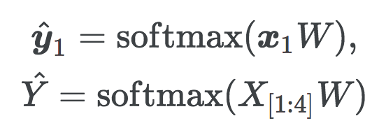

Ở đây, softmax là kí hiệu của hàm softmax,  là ma trận với các vector đặc trưng  xếp theo hàng dọc.

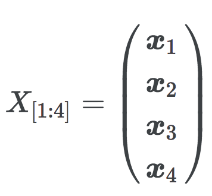

Ma trận  là ma trận trọng số của mạng neural 1 tầng ẩn, ở đây bạn có thể khởi tạo ngẫu nhiên giá trị của ma trận (từ bài 73 trở đi chúng ta sẽ học ma trận trọng số này). Ngoài ra,  là vector biểu diễn xác suất example  thuộc về các lớp khi dùng ma trận chưa được học  để phân loại. Tương tự,  là ma trận biểu diễn xác xuất các example  thuộc về các lớp.

### 72. Tính loss và gradient

Hãy tính hàm cross entropy loss và gradient theo ma trận  đối với example  và tập các example  của tập dữ liệu huấn luyện. Hơn nữa, hàm loss đối với example  được tính bởi công thức sau đây.

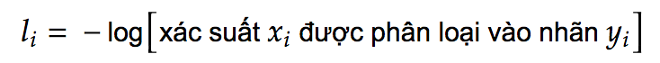

Thật ra, hàm cross-entropy loss đối với một tập các example sẽ lấy trung bình cộng của hàm loss của các example trong tập dữ liệu đó.

### 73. Training với thuật toán Stochastic Gradient Descent

Sử dụng thuật toán Stochastic Gradient Descent (SGD), hãy học ma trận . Thêm nữa, bước training có thể được cho kết thúc bằng một tiêu chuẩn thích hợp (ví dụ "kết thúc khi đã qua 100 epoch").

### 74. Tính độ chính xác

Khi sử dụng ma trận trọng số đã tìm được ở bài tập 73 để phân loại các ví dụ của tập train và tập tập test, hãy tính độ chính xác trên các tập dữ liệu.

### 75. Plot loss và độ chính xác

Sửa code của bài 73, xác nhận trạng thái của quá trình training bằng cách sau mỗi lần kết thúc việc cập nhật tham số trong mỗi epoch, vẽ đồ thị của giá trị hàm loss, accuracy trên tập train và tập valid.

### 76. Checkpoint

Cải biến code của bài tập 75, mỗi khi kết thúc việc cập nhật tham số trong mỗi epoch, lưu lại checkpoint (giá trị của parameter (chẳng hạn ma trận trong số) trong lúc training và trạng thái bên trọng của thuật toán tối ưu hóa) vào file.

### 77. Sử dụng mini-batch

Sửa code của bài 76, hãy tính toán giá trị hàm loss, gradient cho mỗi *B* example và cập nhật giá trị của ma trận trọng số  (mini-batching). Thay đổi giá trị của *B* với các giá trị 1, 2, 4, 8,... và so sánh thời gian học cần thiết cho mỗi epoch.

### 78. Train trên GPU

Cải biến code của bài 77 và thực hiện train trên GPU.

### 79. Mạng neural nhiều tầng

Cải biến code của bài tập 78, hãy thay đổi kiến trúc của mạng neural bằng việc thêm vào bias term và thêm layer, hãy tạo một bộ phân lớp có hiệu quả cao.

<a class="mk-toclify" id="ch-ng-9-rnn-cnn"></a>
## Chương 9: RNN, CNN

### 80. Biến đổi thành số ID

Chúng ta muốn gán cho mỗi từ trong dữ liệu huấn luyện chúng ta đã tạo ra trong bài tập 51 một số ID duy nhất. Hãy gán số ID cho các từ xuất hiện 2 lần trở lên trong dữ liệu huấn luyện bằng phương pháp: từ xuất hiện nhiều nhất được gán ID bằng 1, từ xuất hiện nhiều thứ 2 được gán ID bằng 2,... Sau đó, hãy cài đặt hàm trả về một dãy các ID cho một chuỗi các từ cho trước. Ngoài ra, tất cả các từ có tần suất xuất hiện ít hơn 2 (trong dữ liệu train) được gán ID bằng 0.

### 81. Dự đoán bằng mô hình RNN

Cho trước một chuỗi từ  được biểu diễn bằng các số ID. Trong đó, *T* là độ dài của chuỗi từ,  là biểu diễn one-hot của ID tương ứng với từ (*V* là tổng số từ). Cài đặt phương trình sau đây dưới dạng mô hình dự đoán nhãn *y* từ chuỗi từ *x*, sử dụng mạng neural hồi quy (RNN: Recurrent Neural Network).

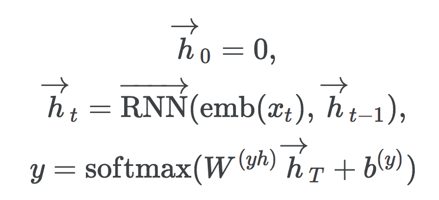

Trong đó  là kí hiệu của word embedding (hàm số biến đổi biểu diễn dạng one-hot của từ thành word vector),  là vector của hidden state tại time step *t*,  là RNN unit để tính toán hidden state tiếp theo từ đầu vào *x* và hidden state tại time step trước,  là ma trận để dự đoán nhãn từ vector của hidden state,  là bias term ( lần lượt là số chiều của word embedding, số chiều của hidden state và số lượng nhãn). Có rất nhiều kiến trúc khác nhau trong RNN unit  và dưới đây là một mô hình cổ điển.

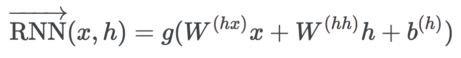

Trong đó, ，,  là tham số của RNN unit, *g* là hàm activation (chẳng hạn hàm tanh hay ReLU).

Chú ý rằng, trong bài tập này, chúng ta không huấn luyện các tham số mà nhãn *y* có thể được dự đoán bằng các tham số được khởi tạo ngẫu nhiên. Hãy chọn các giá trị phù hợp cho các hyperparameter như số chiều, ví dụ: ,  (trong các bài tiếp theo chúng ta sẽ dùng cùng  các hyperparameter đã thiết lập).

### 82. Huấn luyện bằng thuật toán Stochastic Gradient Descent

Sử dụng thuật toán SGD (Stochastic Gradient Descent), hãy huấn luyện mô hình đã tạo ra ở bài 81. Huấn luyện mô hình, đồng thời hiển thị giá trị của hàm loss và độ chính xác trên tập huấn luyện và tập test. Hãy kết thúc giải thuật với tiêu chuẩn thích hợp (ví dụ sau 10 epochs).

### 83. Mini-batching và huấn luyện trên GPU

Sửa code của bài 82, hãy tính toán giá trị hàm loss, gradient cho mỗi *B* example và huấn luyện mô hình (hãy chọn giá trị thích hợp cho *B*). Thêm nữa, hãy train mô hình trên GPU.

### 84. Áp dụng word embedding

Hãy khởi tạo word embedding  bằng pre-trained word vector (chẳng hạn bộ [pre-trained word vector](https://drive.google.com/file/d/0B7XkCwpI5KDYNlNUTTlSS21pQmM/edit?usp=sharing) được huấn luyện trên tập dữ liệu Google News (khoảng 100 tỉ từ)) và huấn luyện mạng neural.

### 85. Bidirection RNN - Mạng RNN nhiều tầng

Sử dụng forward RNN và backward RNN để encode text đầu vào và học mô hình.

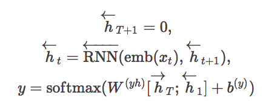

Ở đây,  lần lượt là các hidden state vector ở time step *t*, sinh ra bởi forward và backward RNN,  là RNN unit để tính toán hidden state trước đó từ đầu vào *x* và hidden state *h* ở time step kế tiếp,  là ma trận dự đoán các category từ hidden state vector,  là bias term. Ngoài ra kí hiệu [a; b] biểu diễn vector tạo thành bằng cách concat các vector a và b.

### 86. Mạng neural tích chập (CNN)

Cho trước chuỗi các từ được biểu diễn bằng các số ID . Ở đây, *T* là độ dài của chuỗi từ,  là biểu diễn dạng one-hot của số ID của từ (*V* là số lượng các từ). Sử dụng mạng neural tích chập (CNN: Convolutional Neural Network), cài đặt mô hình dự đoán nhãn *y* từ chuỗi các từ *x*.

Thêm nữa, cấu trúc mạng CNN được cho như ở dưới đây.

- Số chiều của word embedding: 
- Filter size của convolution: 3 token
- Kích thước của stride trong convolution: 1 token
- Có sử dụng padding
- Số chiều của vector của các time step sau convolution operator: 
- Sử dụng max pooling sau convolution layer, biểu diễn câu đầu vào bằng hidden state vector với số chiều 

Vector đặc trưng  tại time step *t* được tính bằng công thức sau.

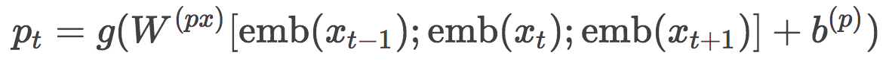

Ở đây,  là tham số của mạng CNN, *g* là hàm activation (chẳng hạn như hàm tanh hay ReLU), [a;b;c] là vector tạo thành bằng cách concat các vector a, b, c. Ngoài ra, lý do số cột của ma trận  là  là ma trận đó dùng để thực hiện biến đổi tuyến tính trên vector được tạo thành bằng cách concate word embedding vector của 3 token.

Max pooling lấy ra giá trị lớn nhất trên toàn bộ time step cho mỗi chiều của vector đặc trưng và tính ra vector  biểu diễn text đầu vào. Nếu biểu diễn giá trị ở vị trí thứ *i* của *c* bằng *c*[*i*] thì Max Pooling được biểu diễn bằng công thức sau đây.

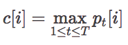

Cuối cùng, áp dụng biến đổi tuyến tính bằng ma trận  và số hạng bias , sau đó là áp dụng hàm softmax trên vector đặc trưng *c* của text đầu vào để dự đoán nhãn *y*.

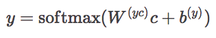

Chú ý rằng, trong bài tập này, chúng ta không học mô hình mà chỉ cần tính toán *y* bằng ma trận trọng số được khởi tạo ngẫu nhiên.

### 87. Huấn luyện mô hình CNN bằng thuật toán Stochastic Gradient Descent

Sử dụng thuật toán SGD (Stochastic Gradient Descent), hãy huấn luyện mô hình đã tạo ra ở bài 86. Huấn luyện mô hình, đồng thời hiển thị giá trị của hàm loss và độ chính xác trên tập huấn luyện và tập test. Hãy kết thúc giải thuật với tiêu chuẩn thích hợp (ví dụ sau 10 epochs).

### 88. Hyperparameter tuning

Sửa code của bài tập 85 và 87, thay đổi kiến trúc mạng và các hyperparameter để xây dựng một bộ phân loại văn bản có hiệu quả cao.

### 89. Transfer learning từ mô hình ngôn ngữ đã được pre-train

Lấy mô hình ngôn ngữ đã được huấn luyện trước (ví dụ BERT) làm xuất phát điểm, hãy xây dựng mô hình phân loại tiêu đề của các bài tin tức.

<a class="mk-toclify" id="ch-ng-10-machine-translation"></a>
## Chương 10: Machine Translation

Trong chương này, chúng ta sẽ sử dụng corpus song ngữ Nhật - Anh của [The Kyoto Free Translation Task (KFTT)](http://www.phontron.com/kftt/index-ja.html)  và huấn luyện mô hình dịch máy dùng mạng neural (neural machine translation). Khi tạo mô hình dịch máy dùng mạng neural, hãy dùng các công cụ có sẵn như [fairseq](https://github.com/pytorch/fairseq), [Hugging Face Transformers](https://github.com/huggingface/transformers) hay [OpenNMT-py](https://github.com/OpenNMT/OpenNMT-py).

### 90. Chuẩn bị dữ liệu

Download dữ liệu dịch máy. Tạo dữ liệu train, dev và test và thực hiện tiền xử lý cần thiết như tokenization. Thực ra ở mức độ này, chúng ta sẽ sử dụng word (trong tiếng Anh) và morpheme (trong tiếng Nhật) như là đơn vị của token.

### 91. Huấn luyện mô hình dịch máy

Sử dụng dữ liệu đã chuẩn bị ở bài tập 90, hãy học mô hình dịch máy dùng mạng neural (có thể chọn mô hình mạng neural như Transformer hay LSTM).

### 92. Áp dụng mô hình dịch máy

Sử dụng mô hình dịch máy neural đã học ở bài tập 91, cài đặt chương trình dịch một câu tiếng Nhật cho trước (tùy ý) ra tiếng Anh.

### 93. Tính BLEU score

Để kiểm tra chất lượng của mô hình dịch máy neural đã học ở bài tập 91, tính điểm BLEU trên dữ liệu test.

### 94. Beam Search

Trong bước decode câu dịch bằng mô hình dịch máy neural đã học ở bài 91, hãy sử dụng thuật toán beam search. Thay đổi beam size từ 1 đến 100 và vẽ đồ thị thể hiện sự biến đổi của BLEU score trên tập dev.

### 95. Sử dụng subword

Thay đổi từ đơn vị của token từ word hoặc morpheme thành subword và thực hiện lại các thí nghiệm từ bài 91 đến bài 94.

### 96. Visualize quá trình training

Sử dụng công cụ chẳng hạn [Tensorboard](https://www.tensorflow.org/tensorboard) hãy visualize quá trình mô hình dịch máy neural được học. Hãy dùng giá trị của hàm loss và BLUE score trên tập train và giá trị hàm loss và BLEU score trên tập dev để quan sát khi visualize quá trình học model.

### 97. Tune hyper-parameters

Thay đổi mô hình mạng neural cùng với các hyper-parameters và tìm ra mô hình mạng và bộ hyper-parameters cho BLEU score cao nhất trên tập dữ liệu dev.

### 98. Domain adaptation

Sử dụng dữ liệu dịch máy [Japanese-English Subtitle Corpus (JESC)](https://nlp.stanford.edu/projects/jesc/index_ja.html) hoặc [JParaCrawl](http://www.kecl.ntt.co.jp/icl/lirg/jparacrawl/), thử tăng performance trên tập test của dữ liệu KFTT.

### 99. Tạo translation server

Tạo hệ thống demo trên nền Web hiển thị kết quả dịch khi người dùng nhập vào một câu muốn dịch.